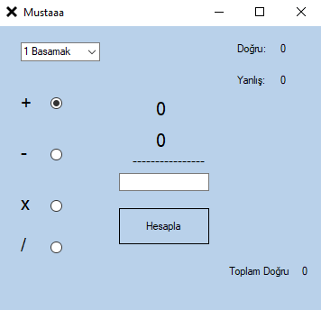

➕➖ Dört İşlem - Matematik Pratik Oyunu
Dört İşlem, her yaştan kullanıcının matematik pratiği yapmasını sağlayan, doğru cevap verdikçe puan kazandıran ve toplam skoru hafızada tutan eğlenceli bir Windows masaüstü uygulamasıdır.

🎯 Özellikler
Uygulama basit bir hesap makinesinden fazlasını sunar:

4 Farklı İşlem Modu: Toplama, Çıkarma, Çarpma ve Bölme işlemleri arasında geçiş yapabilirsiniz.

Zorluk Seviyeleri: "1 Basamak", "2 Basamak" ve "3 Basamak" seçenekleri ile sayıların büyüklüğünü (zorluğu) ayarlayabilirsiniz.

Akıllı Soru Üretimi:

Çıkarma: Sonucun negatif çıkmaması için her zaman büyük sayıdan küçük sayı çıkarılır.

Bölme: Sonucun tam sayı çıkması sağlanır (kalanlı bölme sorulmaz) ve asal sayılar elenerek daha uygun sorular üretilir.

Görsel Geri Bildirim:

Doğru cevapta ekran Yeşil (Lime) olur.

Yanlış cevapta ekran Kırmızı (Tomato) olur.

Kalıcı Puan Sistemi: Toplam doğru sayınız bilgisayarın geçici hafızasında (sayac.txt) saklanır, uygulamayı kapatıp açsanız bile skorunuz silinmez.

🏆 Gizli Ödül (Easter Egg)
Bu uygulama içinde gizli bir ödül mekanizması vardır!

Eğer toplam doğru sayınız 50'ye ulaşırsa, ekranda özel bir mesaj belirir:

"Musti 50TL kazandın gelince söyle verim"

🛠️ Kurulum
Projeyi çalıştırmak için:

Repoyu klonlayın.

DortIslem.sln dosyasını Visual Studio ile açın.

Başlat (Start) tuşuna basın.

💻 Nasıl Oynanır?
Üst menüden zorluk seviyesini seçin (Örn: 1 Basamak).

Sol taraftan işlem türünü seçin (Toplama +, Çıkarma - vb.).

Ekranda beliren sorunun cevabını kutucuğa yazın.

"Hesapla" butonuna basın.

Doğru bildikçe "Toplam Doğru" sayacınız artacaktır.

📂 Teknik Detaylar
Dil: C# (.NET Framework 4.7.2).

Veri Kaydı: Skorlar Path.GetTempPath() dizininde sayac.txt dosyasında tutulur.

Arayüz: Windows Forms (WinForms).

📸 Ekran Görüntüsü

*Uygulamanın ana arayüzü.*
